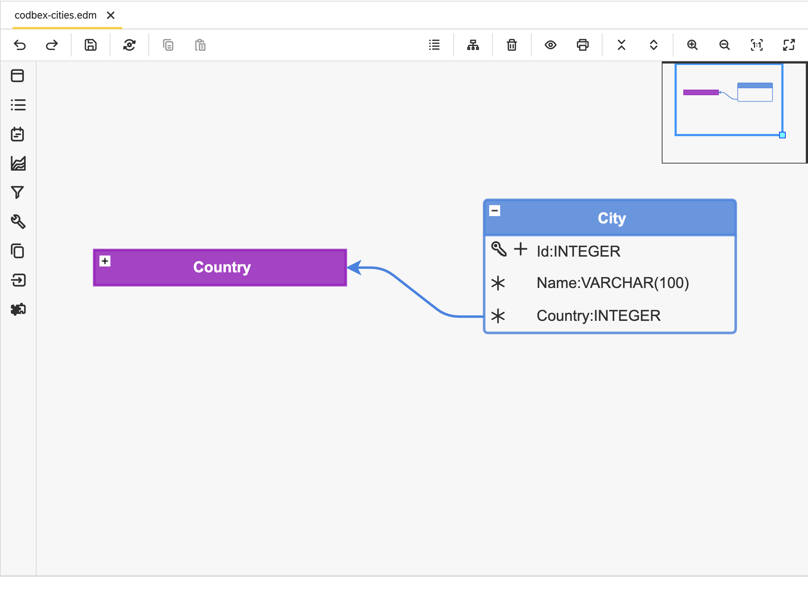

# 📦 codbex-cities

## 📖 Table of Contents
* [🗺️ Entity Data Model (EDM)](#️-entity-data-model-edm)
* [📦 Dependencies](#-dependencies)
* [🧩 Core Entities](#-core-entities)
* [🐳 Local Development with Docker](#-local-development-with-docker)

---

## 🗺️ Entity Data Model (EDM)



## 🧩 Core Entities

### Entity: `City`

#### Fields:
1. **ID**
   - **Type**: INTEGER
   - **Primary Key**: Yes
   - **Identity**: Yes
   - **Description**: Unique identifier for the city.

2. **Name**
   - **Type**: VARCHAR
   - **Length**: 100
   - **Nullable**: No
   - **Description**: Name of the city.

3. **Country**
   - **Type**: INTEGER
   - **Nullable**: No
   - **Description**: Foreign key referencing the country to which the city belongs.
   
---

## 📦 Dependencies

   - [codbex-countries](https://github.com/codbex/codbex-countries)

---

## 🔗 Associated Modules

- [codbex-cities-data](https://github.com/codbex/codbex-cities-data)

---

## 🐳 Local Development with Docker

When running this project inside the codbex Atlas Docker image, you must provide authentication for installing dependencies from GitHub Packages.
1. Create a GitHub Personal Access Token (PAT) with `read:packages` scope.
2. Pass `NPM_TOKEN` to the Docker container:

    ```
    docker run \
    -e NPM_TOKEN=<your_github_token> \
    --rm -p 80:80 \
    ghcr.io/codbex/codbex-atlas:latest
    ```

⚠️ **Notes**
- The `NPM_TOKEN` must be available at container runtime.
- This is required even for public packages hosted on GitHub Packages.
- Never bake the token into the Docker image or commit it to source control.
